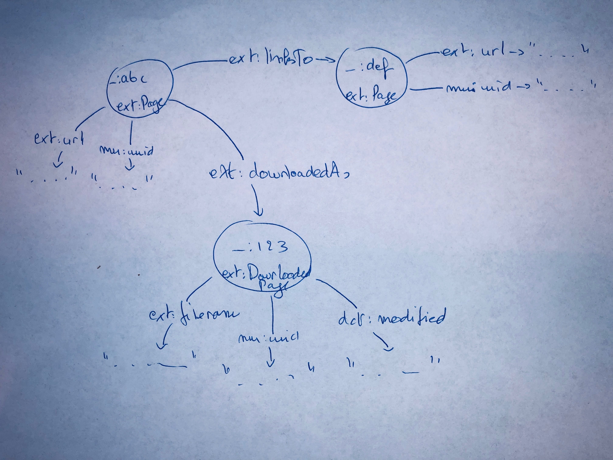

# links scraper
This links scraper is intended to scrape links of an SPA web page.

## Usage
```
drc up -d
drc logs -f links-scraper
```
Then make a post call to
```
http://localhost8891/scrape/
```
with the body:
```
{
    "url": "https://publicatie.gelinkt-notuleren.demo.lblod.info"
}
```
and Content-Type set to application/json

After that the triple store (http://localhost:8890/sparql) will contain the scraped information of the websites and in the scraper-data folder there will be a downloaded version of each of the encountered pages.

The data will be stored with the following scheme: 

## options
### SPARQL config 
There are 2 environment variables for configuring the SPARQL endpoint:
```
MU_SPARQL_ENDPOINT='http://database:8890/sparql'
MU_APPLICATION_GRAPH='http://mu.semte.ch/application'
```
## minimum rescraping age
the minimum age in seconds that need to have passed before a duplicate page will be added to the triple store, this is in milliseconds.
```
ENV MINIMUM_TIME_FOR_RESCRAPING=14400000
```

## blacklisting
As we do not want to scrape the entire internet there is a blacklist file that can be configured. The position of that file is indicated by an environment variable:
```
ENV BLACKLIST_FILE="/app/sites.blacklist"
```
The content of this file is just URLS, for which we will check if they appear *anywhere* in the found links.

## datamodel
The datamodel can be changed by adjusting the scraper/SPARQL.js file. Here all the predicates are documented. To make more complex changes the queries that are being made need to be looked at. Now this file contains an object (SPARQL) that holds the representations as follows:
```
const SPARQL = {
    PREFIXES: "PREFIX mu:<http://mu.semte.ch/vocabularies/> PREFIX muExt:<http://mu.semte.ch/vocabularies/ext/> PREFIX dct:<http://purl.org/dc/terms/> ",
    TYPE_PAGE: "muExt:Page",
    TYPE_DOWNLOADED_PAGE: "muExt:DownloadedPage",
    PREDICATE_URL: "muExt:url",
    PREDICATE_LINKSTO: "muExt:linksTo",
    PREDICATE_DOWNLOADEDAS: "muExt:downloadedAs",
    PREDICATE_FILENAME: "muExt:filename",
    PREDICATE_MODIFIED: "muExt:modified",
    PREDICATE_UUID: "mu:uuid",
    RESOURCE_BASE_PAGE: "http://example.com/resources/pages/",
    RESOURCE_BASE_DOWNLOADED_PAGE: "http://example.com/resources/downloaded-pages/",
    query: query,
    update: update
};

```
